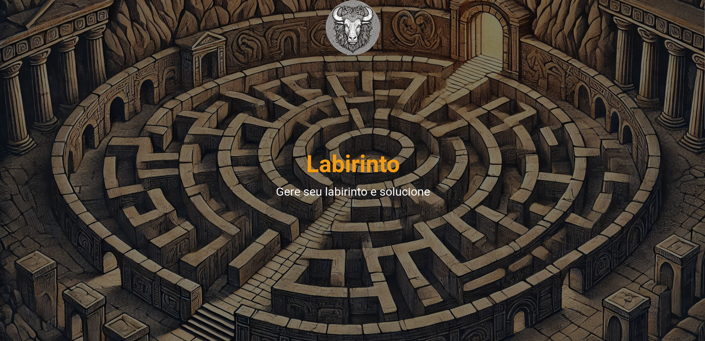
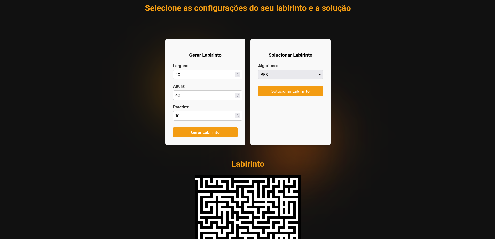
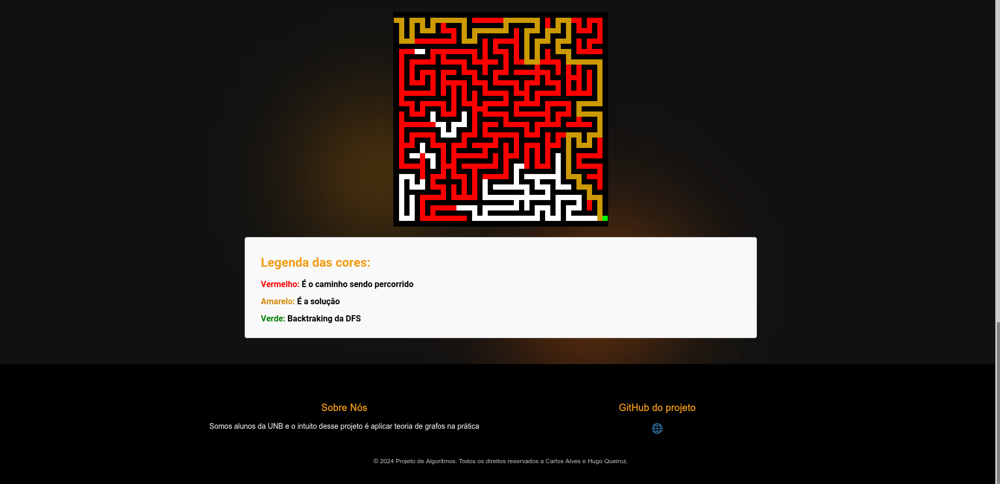
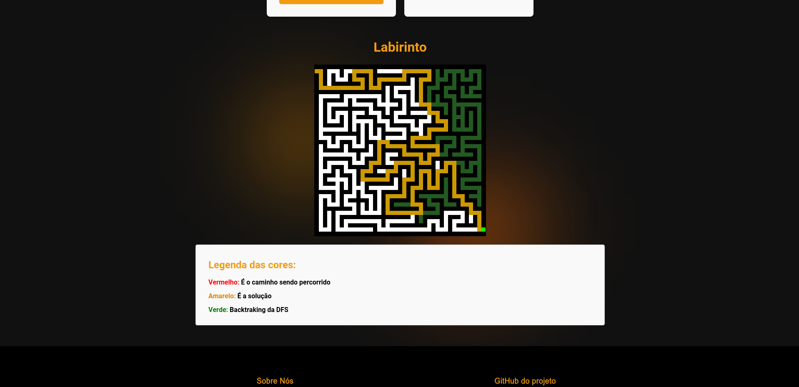

# Maze Runner

**Número da Lista**: 34 <br>
**Conteúdo da Disciplina**: Busca em Largura, Busca em profundidade e Flood Fill<br>

## Alunos
|Matrícula | Aluno |
| -- | -- |
| 22/1022248  |  Carlos Eduardo Mota Alves |
| 22/1021993  |  Hugo Queiroz Camelo de Melo |

## Sobre 
Nosso projeto consiste em um gerador de labirintos que utiliza o algoritmo de Busca em Profundidade (DFS) para criar labirintos de forma aleatória, garantindo que sempre exista um caminho viável entre o ponto de início e o de saída. O labirinto gerado é retornado na forma de uma matriz de pixels em formato RGB.

Para simular o labirinto como um grafo, aplicamos a técnica de preenchimento por inundação (flood fill), onde cada pixel representa um nó, e seus vizinhos imediatos são os pixels adjacentes. Dessa forma, evitamos o uso de uma matriz de adjacência ou lista de adjacência explícita.

Para resolver o labirinto, implementamos uma busca, podendo ser por BFS (Busca em Largura) ou DFS, que percorre o labirinto colorindo o caminho explorado em vermelho. Ao encontrar o caminho até o destino, ele é destacado em amarelo. Na DFS, optamos por destacar também o backtracking com uma cor diferente, realçando as etapas de retrocesso no processo de busca.implementamos uma BFS ou uma DFS, para resolver este labirinto e pintamos de vermelho esta busca e ao achar o caminho ele pinta de amarelo, e no caso da DFS achamos interessante pintar os backtraking.

## Screenshots









## Instalação 
**Linguagem**: Python, Javascript<br>
**Framework**: Flask e React<br>

## Pré-requisitos

### Backend
Para executar o backend do projeto, é necessário ter **Python** instalado (versão recomendada: >= 3.8) e instalar algumas bibliotecas.

#### Passo a Passo

1. **Crie um ambiente virtual (recomendado):**

   ```bash
   python3 -m venv .venv  # Cria um ambiente virtual chamado .venv
   source .venv/bin/activate  # Ativa o ambiente virtual (Linux/macOS)
   .venv\Scripts\activate  # Ativa o ambiente virtual (Windows)

2. **Navegue** até a pasta do backend, onde os algoritmos foram implementados.

3. **Instale as bibliotecas** necessárias executando o seguinte comando:

   ```bash
   pip install -r requirements.txt

### Frontend
Para executar o Frontend do projeto, é necessário ter **Node.js** instalado e instalar o **Npm**.

#### Passo a Passo
1. **Navegue** até a pasta do ```frontend/mazerunner```.
2. **Instale as depedêcias** necessárias executando o seguinte comando:

   ```bash
   npm install


# Uso do Projeto

## Pré-requisitos
Para utilizar o projeto, é necessário que todas as dependências estejam instaladas e configuradas, conforme descrito na seção de **Instalação**.

## Passo a Passo para Uso

1. **Inicie o Backend**
   - Navegue até a pasta do `backend` onde o arquivo `maze.py` está localizado.
   - Com as dependências já instaladas, execute o seguinte comando para iniciar o servidor backend:
     
     ```bash
     python maze.py
     ```

   - Isso iniciará o servidor Flask e manterá o backend ativo, (em `http://127.0.0.1:500`).

2. **Inicie o Frontend**
   - Com o servidor backend em execução, abra um novo terminal e navegue até a pasta do frontend, `frontend/mazerunner`.
   - Certifique-se de instalar as dependências do frontend (caso ainda não tenha feito), executando:
     
     ```bash
     npm install
     ```

   - Após instalar as dependências, inicie o frontend com o comando:
     
     ```bash
     npm start
     ```

   - Esse comando abrirá automaticamente o frontend no navegador (geralmente em `http://localhost:3000`), onde será possível interagir com o gerador e solucionador de labirintos.

3. **Utilizando o Gerador e Solucionador de Labirintos**
   - Na interface do frontend, utilize os botões disponíveis para gerar um labirinto aleatório.
   - Em seguida, selecione a opção de resolver o labirinto. O algoritmo exibirá o caminho de solução diretamente na interface.
   - Explore as funcionalidades de geração e resolução para visualizar o processo e os caminhos destacados.


## Outros 
Quaisquer outras informações sobre seu projeto podem ser descritas abaixo.


